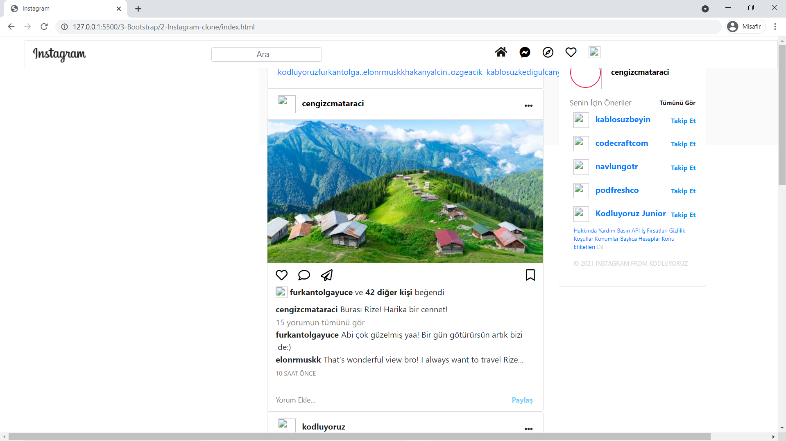

# Instagram Klonu

## Aşagıdaki istenilen maddeler tamamlanmıştır:

* Navbarı yukarı sabitleyip sayfayı aşağı kaydırdığınızda hala yukarıda durmasını sağlayın. İçerik ile birleşmemesi için body'e padding veriniz.
* Navbarın height'ı 54 px olmalı ve arkaplan rengi beyaz olmalı.
* Navbardaki elementlerin doğru yerde olmadığını fark ettiniz mi? Öncelikle navbarın başındaki logo classının içine 192px soldan margin verin.
* Arama kısmını d-flex ile ortay alıp soldan 5 birim margin verin.
* CSS dosyası içindeki ::placeholder kısmının arkaplanına assets klasörü içinde bulunan arama simgesini ekleyin. Ve resmin tekrar etmemesini sağlayın.
* Clone ödevimizdeki ikonları FontAwesome sitesinden aldık. Daha detaylı bilgi için web sitesini ziyaret edin ve nasıl çalıştığını öğrenin.

* Menü kısmına soldan 5 birim üstten 2 birim margin verin.
* Menü kısmına sayfa sm boyutunda olunca kaybolacak şekilde display verin. Bunun için Bootstrap Display property sayfasını inceleyebilirsiniz.
* İçerik alanı (ortadaki alan) offset 4 olmalı ve üstten 2 birim margin almalı.
* Class'da belirttiğimiz middlearea içinde maksimum yükseklik 200px olmalı ve bunu important ile yazmalısınız. (important'ın ne olduğunu, ne işe yaradığını henüz bilmiyorsanız bir   "Css important nedir?" şeklinde aramanızı ve ne işe yaradığını öğrenmenizi öneririz. Unutmayın parametre vermek bazen istemediğiniz durumlara yol açabilir bilinçli kullanmak gerekir.)
* Bu alanın col'unun default değerini 12, diğer tüm ölçekleri ise 6 olarak ayarlayın. Yani normal boyutta 12, sayfa küçülüp büyüdükçe, boyutuyla oynadıkça 6 ölçek olacak şekilde ayarlayın. (Grid sistemin 12'lik olduğunu hatırlayın)
Hikayeler kısmında isimler nasıl resimlerin altına gelecek? (İpucu: Arama kısmında kullandığımız özellik)
* İçerik kısmında üç nokta sağda olmalı.
* Beğenme, yorum yapma, paylaşma kısmında border olmamalı.
* Bookmark ikonunun offset'i 7 birim olmalı.
* Card header ve card footerlar beyaz renk olmalı.
* Yorum paylaş metnini sağa alın.
* Sağ panele verilen alan sizce yeterli mi? Değilse düzeltin.
* Sağ panel için stickysidebar ve rightpanel diye iki class verdiğimizi fark etmişsiniz. Stickysidebar bu panelin sayfayı aşağı kaydırdıkça onun da gelmesini sağlıyor. Bunu sağlamak  için için CSS'in position propertysini kullanabilirsiniz. Rightpanel'de de arkaplan rengi beyaz olup kenarlık olmamalı.
* Tümünü gör ve takip et yazılarını sağa alınız.
* Bütün sayfanın arkaplan rengini Instagram'dan alıp uygulayın.

### Bazı kısımların talimatlarda denildigi gibi yapılması orjinal instagramdan farklı gözükmesine sebep olmuştur.Diger hata, fotograf linkleri geçerliligini yitirdiginden profil fotografları gözükmüyor.Buraya kadar inceleyip okudugunuz için teşekkür ederim :)